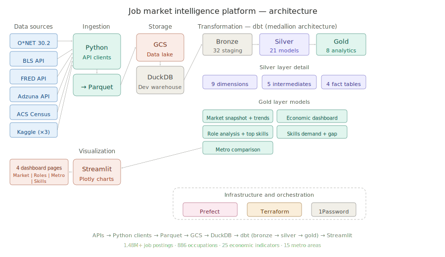
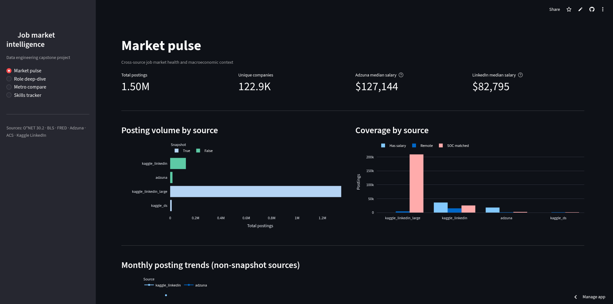

# Job Market Intelligence Platform
## Problem Statement
An end-to-end data engineering project that ingests job market data from 6
sources (government APIs, live job boards, and historical datasets), transforms
it through a medallion architecture, and surfaces insights through an
interactive dashboard. Built to answer: _what does the tech job market actually
look like: what skills are employers asking for, how do salaries compare across
metros, and where is O\*NET's formal taxonomy falling behind market reality?_

---

## Tech stack

##            

## Table of contents

- [Datasets](#datasets)
- [Objectives](#objectives)
- [Architecture](#architecture)
- [Dashboard](#dashboard)
- [Steps to reproduce](#steps-to-reproduce)

---

## Datasets

### Government APIs

| Source                                                    | Type                | What it provides                                                                                                                      | Access                 | Update frequency |
| --------------------------------------------------------- | ------------------- | ------------------------------------------------------------------------------------------------------------------------------------- | ---------------------- | ---------------- |
| [O\*NET 30.2](https://www.onetcenter.org/database.html)   | Bulk download (ZIP) | 886 occupations with skills, knowledge, abilities, technology tools, education requirements, job zones, and 70K+ alternate job titles | Free, no key           | Quarterly        |
| [BLS API v2](https://www.bls.gov/developers/)             | REST API            | Employment stats, unemployment rate, JOLTS (job openings, hires, quits, separations), tech sector employment                          | Free key (500 req/day) | Monthly          |
| [FRED API](https://fred.stlouisfed.org/docs/api/fred/)    | REST API            | 15 macro indicators: unemployment, CPI, fed funds rate, payrolls, labor participation, initial claims, PCE                            | Free key               | Daily to monthly |
| [ACS Census](https://www.census.gov/data/developers.html) | REST API            | 5-year demographic profiles for 15 target tech metros: income, education, commute, industry mix, broadband, WFH rates                 | Free key               | Annual           |

### Live job postings

| Source                                      | Type     | What it provides                                                                                                                                           | Access                 | Update frequency             |
| ------------------------------------------- | -------- | ---------------------------------------------------------------------------------------------------------------------------------------------------------- | ---------------------- | ---------------------------- |
| [Adzuna API](https://developer.adzuna.com/) | REST API | Live job postings with salary (min/max), company, location, category. 30 search queries covering data, software, cloud, ML, security, and management roles | Free key (250 req/min) | Real-time (daily collection) |

### Historical datasets (Kaggle)

| Source                                                                                                                           | Records        | What it provides                                                                              | Time coverage           |
| -------------------------------------------------------------------------------------------------------------------------------- | -------------- | --------------------------------------------------------------------------------------------- | ----------------------- |
| [arshkon/linkedin-job-postings](https://www.kaggle.com/datasets/arshkon/linkedin-job-postings)                                   | 124K postings  | Full LinkedIn postings with salary, skills, companies, benefits, industries. Richest dataset. | March–April 2024        |
| [asaniczka/1-3m-linkedin-jobs-and-skills-2024](https://www.kaggle.com/datasets/asaniczka/1-3m-linkedin-jobs-and-skills-2024)     | 1.35M postings | Large-scale LinkedIn snapshot with comma-separated skills per posting. No salary.             | January 2024 (snapshot) |
| [asaniczka/data-science-job-postings-and-skills](https://www.kaggle.com/datasets/asaniczka/data-science-job-postings-and-skills) | 12K postings   | Data science focused subset with skills and job summaries. No salary.                         | January 2024 (snapshot) |

### By the numbers

| Metric                                       | Count   |
| -------------------------------------------- | ------- |
| Total job postings ingested                  | 1.48M+  |
| O\*NET occupations                           | 886     |
| O\*NET alternate job titles                  | ~70,000 |
| BLS time series                              | 10      |
| FRED economic indicators                     | 15      |
| ACS target metros                            | 15      |
| Adzuna search queries (daily)                | 30      |
| Bronze staging models                        | 32      |
| Silver models (dims + intermediates + facts) | 21      |
| Gold analytical models                       | 8       |
| Parquet files ingested                       | 40+     |
| Seeds (reference tables)                     | 4       |

---

## Objectives

1. **Build a production-grade data pipeline**: ingest from 6 heterogeneous
   sources (REST APIs, bulk downloads, Kaggle CSVs), normalize into Parquet,
   load into a cloud data lake, and transform through a medallion architecture.

2. **Unify job market data across sources**: map LinkedIn job titles to O\*NET
   SOC codes using alternate title matching, normalize salary data across
   different pay periods and currencies, and standardize location data via
   Census geo-enrichment.

3. **Surface actionable labor market insights**: which skills are employers
   actually asking for vs. what O\*NET formally catalogs? How do tech salaries
   compare across metros after adjusting for cost of living? Which occupations
   are growing?

4. **Demonstrate data engineering best practices**: infrastructure as code
   (Terraform), secrets management (1Password CLI), orchestration (Prefect),
   idempotent pipelines, data quality testing (dbt tests), and reproducible
   environments.

---

## Architecture

### Overview



The pipeline follows a **medallion architecture** (bronze → silver → gold):

- **Ingestion layer**: Python clients fetch data from 6 sources (O\*NET bulk
  ZIP, BLS API, FRED API, Adzuna API, ACS Census API, Kaggle CLI). Each client
  handles rate limiting, pagination, and error retries. Raw responses are saved
  as JSON, then converted to Parquet with schema enforcement.

- **Storage layer**: Parquet files are uploaded to a Google Cloud Storage bucket
  (`job-market-lakehouse`) provisioned via Terraform. The bucket uses lifecycle
  rules: 30-day transition to Nearline storage, 90-day deletion for raw files. A
  service account with `objectAdmin` + `legacyBucketReader` handles
  authentication.

- **Transformation layer**: dbt Core runs against DuckDB (local development) or
  Databricks (production). The medallion architecture has three layers:
  - **Bronze (32 models)**: `SELECT *` passthrough from Parquet. No
    transformations, preserves raw column names.
  - **Silver (21 models)**: 9 dimension tables (occupations, skills, knowledge,
    work activities, technology tools, education, metros, companies, date
    spine), 5 intermediate enrichment tables (salary normalization,
    geo-enrichment, skills resolution, SOC code mapping), and 4 fact tables
    (unified postings, posting skills, BLS observations, FRED indicators).
  - **Gold (8 models)**: Dashboard-ready analytics: market snapshot, market
    trends, economic dashboard, role analysis, role top skills, skills demand,
    metro comparison, occupation skills profile (O\*NET vs market gap analysis).

- **Orchestration**: Prefect manages the daily pipeline with tasks for API
  ingestion, Parquet conversion, GCS upload, and dbt build. Supports selective
  execution via `--mode` flag (full, ingest, apis, convert, upload, transform)
  and `--apis` filter (bls, fred, adzuna, acs).

- **Infrastructure**: Terraform provisions the GCS bucket, service account, and
  IAM bindings. 1Password CLI (`op run`) injects secrets at runtime so no
  credentials touch disk or git.

- **Visualization**: Streamlit reads from gold layer CSVs and renders 4
  dashboard pages with Plotly charts.

### Key data transformations

- **Salary normalization** (arshkon LinkedIn): Corrects mislabeled pay periods
  by magnitude analysis (a "$150,000 MONTHLY" is actually yearly), annualizes
  all salaries to USD, filters to $15K–$1M range.
- **SOC code matching**: Builds a lookup table from ~70K O\*NET alternate
  titles + 886 canonical titles, deduplicates, and left-joins to posting titles
  for occupation classification. Current exact-match rate: 7–20% depending on
  source.
- **Geo-enrichment** (Adzuna): Parses `location.display_name` into
  city/county/state using a US cities/states/counties seed. Matches to CBSA FIPS
  codes for ACS metro joins.
- **Skills cleanup**: Normalizes 100+ variant names (e.g., "problemsolving" →
  "problem solving", "ms excel" → "excel"), then filters ~80 ILIKE patterns to
  remove licenses, degrees, age requirements, employer boilerplate, and retail
  operational tasks that leak from source data.
- **O\*NET pivot**: Collapses IM (importance) and LV (level) scale rows into
  single rows per occupation × skill using `MAX(CASE WHEN...)` conditional
  aggregation.

---

## Dashboard

The dashboard is built with Streamlit and Plotly, deployed to Streamlit
Community Cloud.



[Link](https://job-market-lakehouse.streamlit.app)

### Pages

**Market pulse**: KPI cards showing total postings, median salaries, and SOC
match rates across all 4 data sources. Source comparison bar chart. Monthly
posting volume trend line (from non-snapshot sources). Economic indicators
filtered by category (employment, inflation, labor demand, productivity) with
10-year BLS/FRED time series.

**Role deep-dive**: Filterable by SOC prefix (15- Computer, 17- Engineering, 13-
Business, etc.). Sortable occupation table with posting volume, salary
percentiles, remote %, and experience level. Dropdown to select a role and see
its top 15 skills as a horizontal bar chart with O\*NET importance overlay. Role
detail card with education requirements from O\*NET.

**Metro compare**: Bar chart of states by posting volume colored by salary.
Scatter plot of median tech salary vs. ACS household income for matched metros
(above the diagonal = strong purchasing power). Detail table with ACS
demographics: bachelor's rate, WFH rate, tech industry density, unemployment,
commute time.

**Skills tracker**: Adjustable top-N bar chart of skills by total mentions.
Donut chart of the O\*NET vs. market gap split (163K market-only entries, 24K
O\*NET-only, 2.8K aligned). Emerging tech tools chart filtered to SOC 15-
(Computer occupations). Drilldown table to explore gap direction by specific
occupation.

---

## Steps to reproduce

### Prerequisites

- Python 3.11+
- [uv](https://docs.astral.sh/uv/) (recommended) or pip
- [DuckDB CLI](https://duckdb.org/docs/installation/) (for local development)
- [Terraform](https://www.terraform.io/downloads) (for GCS provisioning)
- [gcloud CLI](https://cloud.google.com/sdk/docs/install) (for GCS
  authentication)
- A Google Cloud project with billing enabled
- [1Password CLI](https://developer.1password.com/docs/cli/) (optional: for
  secrets management)
- API keys for: [BLS](https://data.bls.gov/registrationEngine/),
  [FRED](https://fredaccount.stlouisfed.org/apikeys),
  [Adzuna](https://developer.adzuna.com/signup),
  [ACS Census](https://api.census.gov/data/key_signup.html)
- [Kaggle CLI](https://www.kaggle.com/docs/api) configured with
  `~/.kaggle/kaggle.json`

### 1. Clone and install

```bash
git clone https://github.com/sudoneoox/job-market-lakehouse.git
cd job-market-lakehouse

# Using uv (recommended)
uv sync
```

### 2. Configure secrets

Copy the example env file and fill in your API keys:

```bash
cp .env.example .env.secrets
```

Edit `.env.secrets` with your keys (see env.example):

```env
BLS_API_KEY=your_key
FRED_API_KEY=your_key
ADZUNA_APP_ID=your_id
ADZUNA_API_KEY=your_key
ACS_API_KEY=your_key
GCS_BUCKET_NAME=job-market-lakehouse
GOOGLE_APPLICATION_CREDENTIALS=infra/sa-key.json
KAGGLE_TOKEN=your_key
```

If using 1Password, reference secrets with `op://` URIs instead and run with
`scripts/with-secrets.sh`.

### 3. Provision infrastructure

```bash
# One-time GCP setup
bash scripts/gcloud-init.sh

# Provision GCS bucket + service account
cd infra
cp terraform.tfvars.example terraform.tfvars
# Edit terraform.tfvars with your GCP project ID
terraform init
terraform apply
cd ..
```

### 4. Configure dbt

```bash
# Copy the sample profile
cp dbt/profiles.sample.yml ~/.dbt/profiles.yml
```

Edit `~/.dbt/profiles.yml`: the `dev` target uses DuckDB (no external services
needed):

```yaml
job_market_lakehouse:
  target: dev
  outputs:
    dev:
      type: duckdb
      path: data/lakehouse_dev.duckdb
      threads: 4
```

### 5. Run the pipeline

```bash
# Full pipeline: ingest all sources → convert to Parquet → upload to GCS → run dbt
scripts/with-secrets.sh python -m orchestration.flows.daily_pipeline --mode full

# Or step by step:
# Ingest all APIs
scripts/with-secrets.sh python -m orchestration.flows.daily_pipeline --mode apis

# Ingest specific APIs only
scripts/with-secrets.sh python -m orchestration.flows.daily_pipeline --mode apis --apis adzuna fred

# Download O*NET + Kaggle datasets
scripts/with-secrets.sh python -m orchestration.flows.daily_pipeline --mode ingest

# Convert to Parquet
scripts/with-secrets.sh python -m orchestration.flows.daily_pipeline --mode convert

# Upload to GCS
scripts/with-secrets.sh python -m orchestration.flows.daily_pipeline --mode gcs-upload

# Run dbt transformations
scripts/with-secrets.sh python -m orchestration.flows.daily_pipeline --mode transform
```

### 6. Verify with diagnostics

```bash
# Load seeds
cd dbt && dbt seed && cd ..

# Build all models
cd dbt && dbt build && cd ..

# Run diagnostic queries
mkdir -p data/diagnostics
duckdb data/lakehouse_dev.duckdb < scripts/gold_diagnostics.sql

# Check row counts
cat data/diagnostics/00_row_counts.csv
```

### 7. Launch the dashboard

```bash
# Export gold tables to CSV
mkdir -p data/tableau
duckdb data/lakehouse_dev.duckdb < scripts/export_for_dashboard.sql

# Install dashboard dependencies
pip install streamlit pandas plotly

# Run locally
streamlit run dashboard/app.py
# Opens at http://localhost:8501
```

### 8. Daily Adzuna collection (optional)

To accumulate time-series data for the Market Trends page:

```bash
# Run daily (or set up as a cron job)
scripts/with-secrets.sh python -m orchestration.flows.daily_pipeline --mode apis --apis adzuna

# After accumulating data, rebuild:
scripts/with-secrets.sh python -m orchestration.flows.daily_pipeline --mode convert
cd dbt && dbt build && cd ..
duckdb data/lakehouse_dev.duckdb < scripts/export_for_dashboard.sql
```

Cron example (runs at 6 AM daily):

```bash
0 6 * * * cd /path/to/project && scripts/with-secrets.sh python -m orchestration.flows.daily_pipeline --mode apis --apis adzuna
```

---

## Project structure

```
├── conf/
│   ├── apis.yml                  # API endpoints + download URLs
│   ├── ingestion.yml             # Query parameters for all APIs
│   └── logging.yml               # Logging configuration
├── dashboard/
│   ├── app.py                    # Streamlit dashboard (4 pages)
│   └── requirements.txt
├── dbt/
│   ├── models/
│   │   ├── bronze/               # 32 staging models (SELECT * from Parquet)
│   │   ├── silver/
│   │   │   ├── dimensions/       # 9 dimension tables
│   │   │   ├── intermediate/     # 5 enrichment models
│   │   │   └── facts/            # 4 fact tables
│   │   └── gold/                 # 8 analytical models
│   ├── macros/                   # parquet_path, skills_array_agg, cross-db helpers
│   ├── seeds/reference/          # state_to_cbsa_bridge, skill_name_normalization, etc.
│   └── profiles.sample.yml
├── infra/
│   ├── main.tf                   # GCS bucket + SA + IAM
│   ├── variables.tf
│   └── terraform.tfvars.example
├── orchestration/
│   ├── flows/daily_pipeline.py   # Main Prefect flow
│   ├── tasks/                    # Ingestion, dbt, storage, notification tasks
│   └── deployments/
├── scripts/
│   ├── gcloud-init.sh            # One-time GCP setup
│   ├── with-secrets.sh           # 1Password secret injection
│   ├── gold_diagnostics.sql      # Data quality checks (11 CSV outputs)
│   └── export_for_dashboard.sql  # Gold → CSV for Streamlit
├── src/
│   ├── ingestion/                # API clients (BLS, FRED, Adzuna, ACS, O*NET, Kaggle)
│   └── utils/                    # Config, CSV sanitization
├── tests/
│   ├── unit/
│   └── integration/
├── .env.example
└── prefect.yaml
```

---
